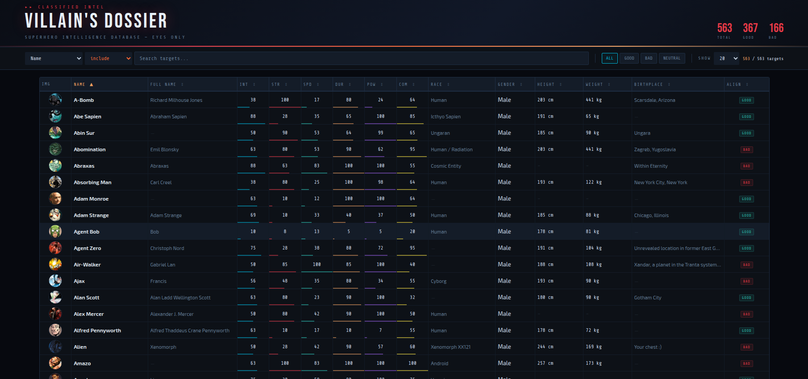

# Villain's Dossier — Sortable

A superhero intelligence database. Browse, search, sort and inspect all 731 heroes and villains from the [Superhero API](https://akabab.github.io/superhero-api/).



🔴 **[Live Demo](https://nwntaspap.github.io/Sortable)**

---

## Features

**Table**

- Displays icon, name, full name, all 6 power stats, race, gender, height, weight, birthplace and alignment
- Initially sorted by name (ascending) — click any column header to sort, click again to reverse
- Missing values always sort last regardless of direction
- Numeric-aware sort — `78 kg` correctly comes before `100 kg`

**Search**

- Filters results on every keystroke (no search button needed)
- Choose which field to search: name, race, alignment, publisher, any power stat, or all text fields at once
- Seven search operators: `include`, `exclude`, `fuzzy`, `=`, `≠`, `>`, `<`

**Pagination**

- Page sizes: 10, 20 (default), 50, 100, or all results

**Detail view**

- Click any row to open a full hero profile with large image, stat bars, appearance and biography

**URL sync**

- Every search, sort, filter and open modal is encoded in the URL
- Copy and paste the URL in another tab — the exact same view is restored

---

## How to run

The page uses `fetch()` to load data, so it must be served over HTTP — opening `index.html` directly as a `file://` URL will not work.

**Python**

```bash
python3 -m http.server 8080
# open http://localhost:8080
```

**Node.js**

```bash
npx serve .
```

**VS Code**
Install the [Live Server](https://marketplace.visualstudio.com/items?itemName=ritwickdey.LiveServer) extension → right-click `index.html` → _Open with Live Server_

---

## Project structure

```
Sortable/
├── index.html
├── styles/
│   ├── base.css      # CSS variables, reset, fonts, scrollbar
│   ├── layout.css    # Header and toolbar
│   ├── table.css     # Table, pagination, loading/error states
│   └── modal.css     # Hero detail modal
└── scripts/
    ├── helpers.js    # Pure data functions (getValue, parseWeightKg, fuzzyMatch…)
    ├── filter.js     # Search operators + applyFiltersAndSort pipeline
    ├── render.js     # buildRow, renderTable, renderPagination
    ├── modal.js      # openModal, closeModal
    └── main.js       # State, DOM refs, event listeners, fetch, URL sync
```

Scripts are loaded in the order listed — each file depends only on the files above it. `main.js` is the entry point that wires everything together; `helpers.js` has zero dependencies and is the best place to start reading.

---

## Data

Fetched at runtime from:

```
https://rawcdn.githack.com/akabab/superhero-api/0.2.0/api/all.json
```

731 heroes and villains. No API key required.

---

## Built with

- Vanilla HTML, CSS and JavaScript — no frameworks or libraries
- [Superhero API](https://github.com/akabab/superhero-api) by akabab
- Fonts: [Bebas Neue](https://fonts.google.com/specimen/Bebas+Neue), [Share Tech Mono](https://fonts.google.com/specimen/Share+Tech+Mono), [Exo 2](https://fonts.google.com/specimen/Exo+2) via Google Fonts
